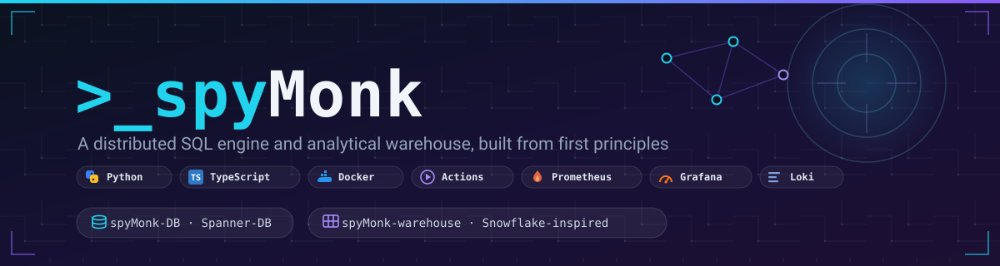

<p align="center">
  
</p>

# spyMonk

A two-part data platform, built from first principles:

| Project | What it is | Docs |
|---|---|---|
| [**spyMonk-DB**](spyMonk-DB/) | Google Spanner-inspired distributed database: hybrid logical clocks + commit-wait, MVCC over WAL/memtable/SSTables, 2PL wound-wait transactions, Paxos replication, gRPC server with token auth + optional TLS | [README](spyMonk-DB/README.md) · [architecture](spyMonk-DB/docs/ARCHITECTURE.md) |
| [**spyMonk-warehouse**](spyMonk-warehouse/) | Snowflake-inspired warehouse on top of spyMonk-DB: columnar micro-partitions, zone-map pruning, versioned result cache, JOIN-capable SQL, React UI, AI SQL assistant | [README](spyMonk-warehouse/README.md) |

Design reference: [`spanner.pdf`](spanner.pdf) (the Spanner paper).

## Repository layout

```
spyMonk-DB/                    the database (own git repo, PyPI pkg: spymonk-db-enterprise)
spyMonk-warehouse/             the warehouse app (own git repo: FastAPI backend + React frontend)
monitoring/                    Loki + Promtail + Grafana config
docker-compose.yml             runs the warehouse (built with the DB library baked in)
docker-compose.monitoring.yml  runs the observability stack
```

## Quick start

**Everything in Docker:**

```bash
docker compose up --build                                  # warehouse on :8000
docker compose -f docker-compose.monitoring.yml up -d      # Grafana on :3000 (admin/admin)
```

**Local development:**

```bash
# Backend
cd spyMonk-warehouse/backend
python3 -m venv .venv && source .venv/bin/activate
pip install -r requirements-dev.txt && pip install -e ../../spyMonk-DB
cp .env.example .env
uvicorn main:app --reload --port 8000

# Frontend (separate terminal)
cd spyMonk-warehouse
npm install && cp .env.example .env.local
npm run dev                                                # UI on :5173
```

**Tests:**

```bash
(cd spyMonk-DB && .venv/bin/python -m pytest tests -v)            # 173 tests
(cd spyMonk-warehouse/backend && .venv/bin/python -m pytest tests -v)  # 41 tests
```

## Documentation

| Document | Description |
|---|---|
| [DEPLOYMENT_ROADMAP.md](DEPLOYMENT_ROADMAP.md) | Production deployment plan (Cloudflare Pages + Railway + DB cluster) |
| [PACKAGING_GUIDE.md](PACKAGING_GUIDE.md) | Building spyMonk-DB wheels and running a private PyPI |
| [SECURITY_FIXES_SUMMARY.md](SECURITY_FIXES_SUMMARY.md) | Record of the warehouse backend security hardening |
| [QUICK_COMMANDS.md](QUICK_COMMANDS.md) | Command cheat-sheet |
